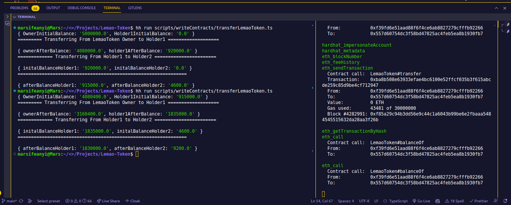
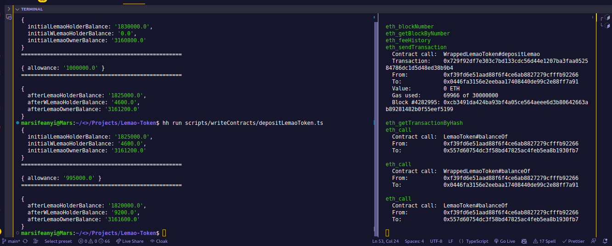
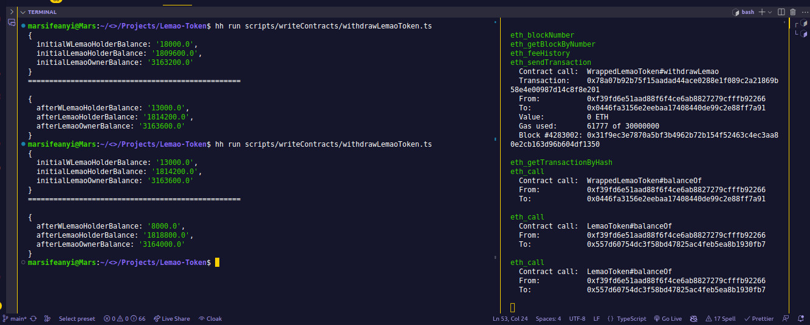

# Bulding Lemao and WrappedLemao Tokens

## Description

[Lemao](https://sepolia.etherscan.io/address/0x557d60754DC3f58bD47825ac4FeB5Ea8B1930fB7#code) contract is an ERC20 Token that charges 8% fee on transfers ie it charges the user 8% fee anytime they want to transfer Lemao token (LMA) to another user.

- On calling the transfer() 8% fee is charged and paid to the owner address.
  [WrappedLemao](https://sepolia.etherscan.io/address/0xd615dbf20dA2C7E83f5D1AD3e5f0E0535E23743B#code) Receipt contract that wraps the Lemao token. It accepts only Lemao tokens
  It has two main functions:
- depositLemao()
- withdrawLemao()

depositLemao() allows users to easily deposit Lemao tokens.
When a user deposits Lemao token in the WLemao contract, it mints a receipt token of the same amount of WLemao token to the user.
Users can easily transfer WrappedLemao tokens(WLMA) without paying fees (Zero fees on transfer).

withdrawLemao() allows users to easily convert WrappedLemao token back to Lemao token.
For users to get their Lemao tokens back, they deposit their WrappedLemao tokens back to the WrappedLemao contract by calling the withdrawLemao(), This burns the receipt token and transfers back the Lemao token to the user.

### LemaoToken Contract Address

https://sepolia.etherscan.io/address/0x557d60754DC3f58bD47825ac4FeB5Ea8B1930fB7#code

### WrappedLemaoToken Contract Address

https://sepolia.etherscan.io/address/0x0446FA3156E2eEBaa17408440De99c2e88ff7a91#code

#### Transferring LemaoToken

#### Depositing LemaoToken

#### Withdrawing LemaoToken

